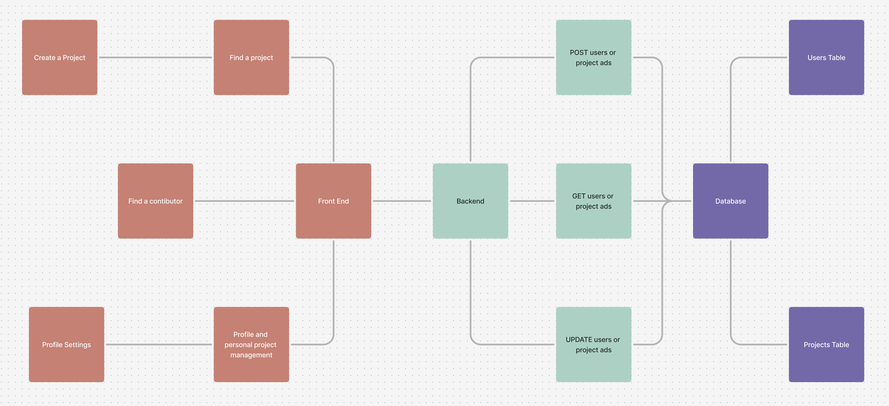
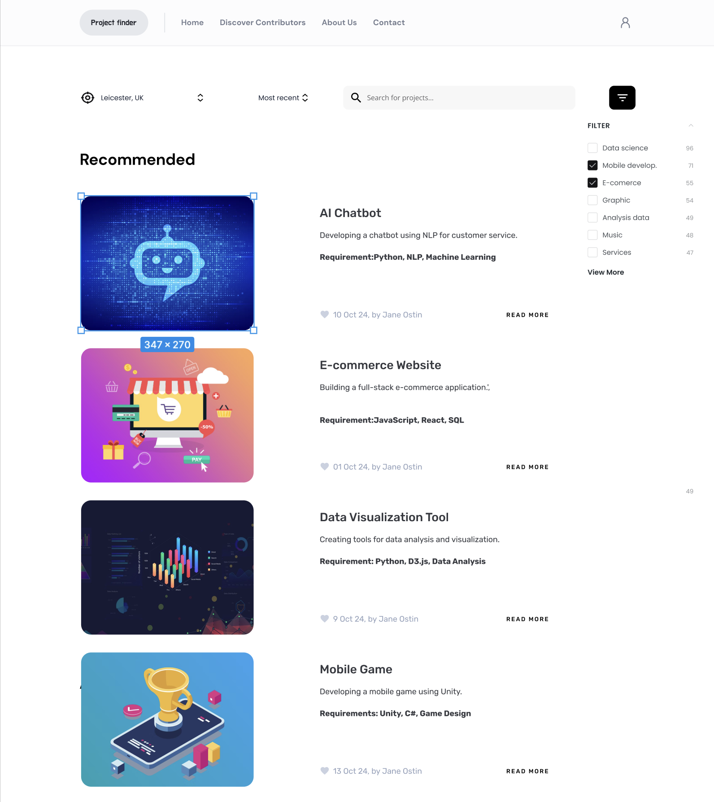

## Overview

As a team of 5, we created a web application that would allow students to find projects to work on for their portfolio. By creating a user system, we allowed users to both post their project ideas and join other people's projects, encouraging collaboration.

Portfolio projects are an important part of building an understanding of technologies, and also portray to employers a genuine interest in the subject. More high-level and specific projects can allow students to demonstrate this interest towards certain fields such as Data Science, Game Dev, and many others.

We were tasked with creating an application that would benefit people at the University of Leicester or the wider local community. Projects were judged by a panel from the Computer Science society and proxies from Capital One, based on:

- Solution Viability
- Technical Sophistication of Solution
- Group Cohesion and Overall Teamwork
- Presentation Quality

We felt our idea provided a solution to University of Leicester CS students who were looking to expand their portfolio but were unsure where to start, or nervous about working alone.

## Approach & Architecture

Given that we wanted to create a web application, we chose Next.js for the frontend and Python Flask for the backend. For the prototype, a simple database was necessary and we chose SQLite.

Next.js was chosen by the frontend team for quick setup and flexibility. Python Flask was chosen on the backend because the team was familiar with Python, and it integrated well with SQLite — a lightweight database suitable for prototyping.

The Flask API exposed endpoints covering project CRUD and join request handling. SQLite was chosen for portability — no database server to configure during a hackathon. The Next.js frontend consumed the API via `fetch`, with client-side state managed through React hooks.

## Development & Learning

As teams were randomly allocated, the first priority was understanding each member's strengths so we could optimise production and fairly split the work. I volunteered as team lead, setting up the Git repository via GitHub and communication channels via Discord.

My programming role was to work on the backend, but as team lead I also ensured all participants were aligned with the project idea and that individual technical difficulties were resolved quickly — including integrating code from all team members, which required comprehensive understanding of every part of the project.

To optimise our time, we split the group into a frontend sub-team and a backend sub-team. My contributions within the backend team:

- Designed the database schema with the required tables for user data and project listings
- Designed the APIs allowing the frontend to communicate with the database
- Implemented those APIs and integrated them into the Next.js frontend

*Mockup of the home page design*
